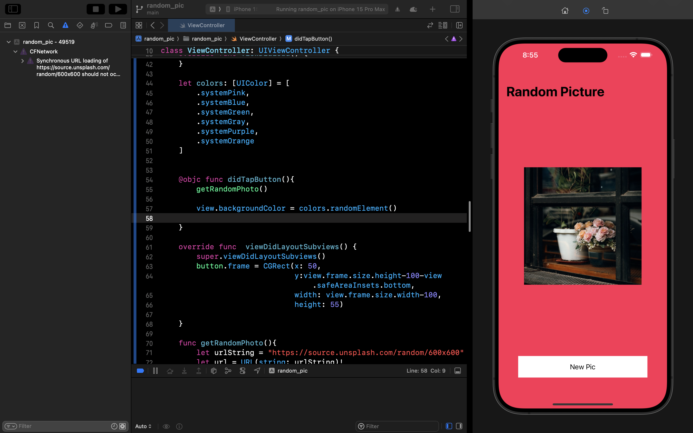
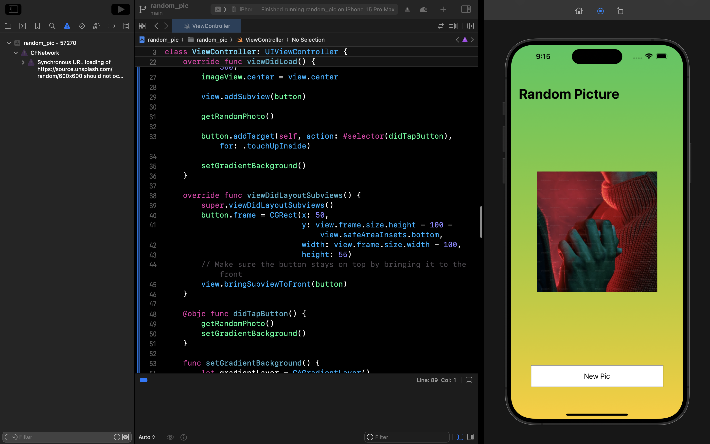

# Random Pic iOS App

This is a simple iOS app that displays a random image from Unsplash and changes the background gradient each time you tap the "New Pic" button.

## Features

- Display random images from Unsplash.

- Change the background gradient dynamically.

- Simple UI with a button to fetch a new random image.

## Screenshots

## Requirements

- Xcode 12 or later

- Swift 5.0 or later

## Usage

1\. Launch the app on your iOS device or simulator.

2\. Tap the "New Pic" button to fetch a new random image and change the background gradient.

## Credits

- [Unsplash](https://unsplash.com) for providing random images.

## License

This project is licensed under the MIT License - see the [LICENSE](LICENSE) file for details.
