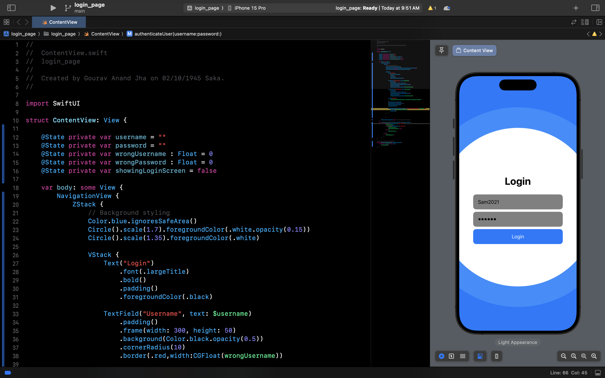

# Simple Login UX in Swift for iOS

This repository provides a basic implementation of a login user interface (UX) in Swift for iOS. The goal is to offer a starting point for developers who want to create a simple and functional login screen in their iOS applications.

## Features

- Username and password input fields

- Secure password entry

- Login button

- Basic error handling and validation

- Clean and straightforward user interface

## Requirements

- Xcode (version X or later)

- Swift (version 5 or later)

- iOS deployment target: 13.0 or later

## Sample Screenshot

<!-- Add a description or caption if needed -->
*Login Screen of the Simple Login UX*

## Usage

You can use this project as a starting point for integrating a simple login screen into your own iOS application. Feel free to customize and extend the code according to your specific requirements.

## Acknowledgments

- This project was inspired by the need for a simple and reusable login UX for iOS applications.

Happy coding!
