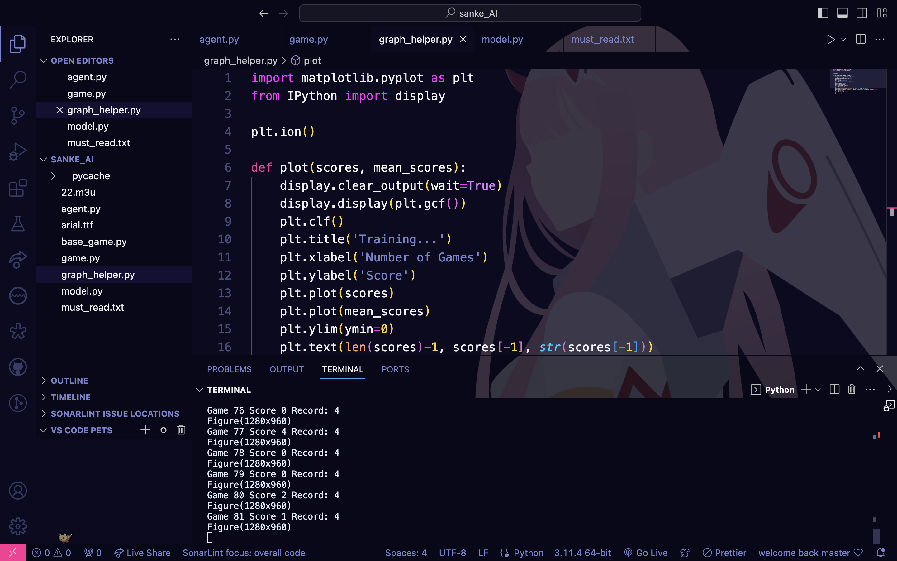
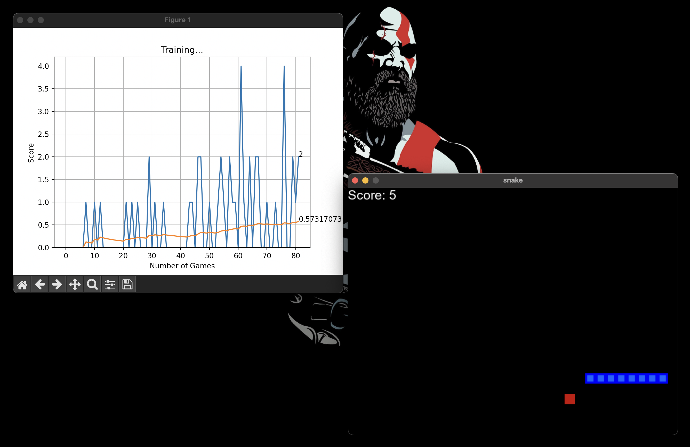

AI Snake Game using Reinforcement Learning
==========================================

This project implements a Snake game played by an AI agent trained using reinforcement learning. The agent learns to play the game by getting a reward of +10 for eating the food, and a reward of 0 for crashing. The learning process is implemented using the Adam machine learning model.

Files
-----

### 1\. `game.py`

This file contains the Snake game implementation. The game logic, including movement, food placement, and collision detection, is defined here. The game environment where the AI agent will learn is created in this file.

### 2\. `model.py`

The `model.py` file defines the AI model, which uses the Adam machine learning algorithm for reinforcement learning. The model learns from the game environment and updates its strategy based on the rewards received.

### 3\. `agent.py`

The `agent.py` file combines the game environment and the AI model. It orchestrates the interaction between the game and the AI agent. The agent's actions are determined by the model's predictions.

### 4\. `requirements.txt`

This file contains the necessary dependencies required to run the project. Use the following command to install the dependencies:

Copy code

`pip install -r requirements.txt`

How to Run
----------

To run the AI Snake Game, make sure you have Python installed along with the required dependencies. Then, execute the following command:

Copy code

`python agent.py`

This command will start the learning process, and the AI agent will begin playing the Snake game. The training process will continue until the agent achieves a satisfactory level of performance.

Dependencies
------------

-   Python 3.x
-   IPython
-   Matplotlib

Make sure to install the dependencies using the `requirements.txt` file before running the project.

## Sample Images

## License

This project is licensed under the MIT License - see the [LICENSE](LICENSE) file for details.

Feel free to explore and modify the code to experiment with different reinforcement learning algorithms and strategies for training the AI agent. Happy coding!
