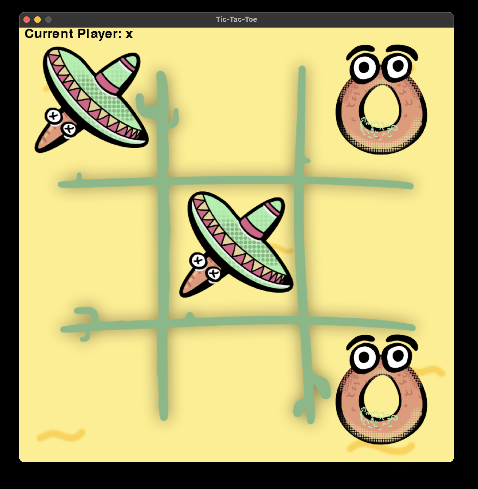

Certainly! Here's a simplified version of the README.md file for your Tic-Tac-Toe game project using Pygame.

---

# Tic-Tac-Toe Game with Pygame

A simple implementation of the classic Tic-Tac-Toe game using Python and Pygame.

## How to Play

1\. **Installation:**

   - Clone the repository:

     ```

     git clone <repository-url>

     ```

   - Install Python if you haven't already: [python.org](https://www.python.org/downloads/).

   - Install Pygame:

     ```

     pip install pygame

     ```

2\. **Run the Game:**

   - Navigate to the project folder.

   - Run `mainpygame.py`:

     ```

     python mainpygame.py

     ```

3\. **Game Rules:**

   - Click an empty cell to make a move.

   - Players take turns - 'X' and 'O'.

   - The game ends when a player wins or it's a tie.

## Controls

- **Left Click:** Make a move in an empty cell.

## Screenshots



## Game Assets

The game assets (cross and naught images, board background, etc.) are in the `assets/art/` directory.

## Contributing

Feel free to contribute by opening an issue or a pull request.

## License

This project is licensed under the MIT License - see the [LICENSE](LICENSE) file for details.

Enjoy playing Tic-Tac-Toe with your friends!

---

In this simplified version:

- **Game Rules:** Briefly explains how to play the game.

- **Controls:** Provides a simple description of the controls.

- **Contributing:** Encourages contributions with minimal guidelines.

- **License:** Specifies the project's license.

Feel free to further customize the README according to your preferences.
